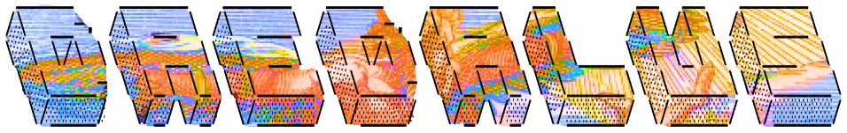
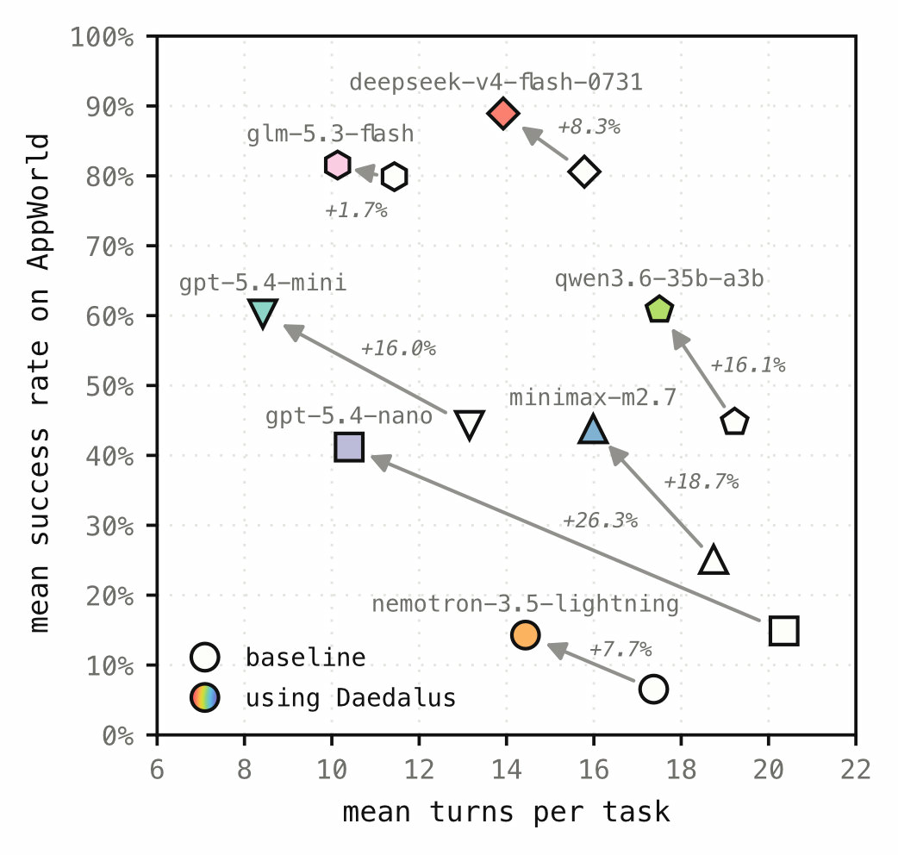

<p align="center">
  <picture>
    
  </picture>
</p>

<h3 align="center">DAEDALUS: Bootstrapping Agent Memory from Self-Generated Tasks</h3>

<p align="center">
  
  <a href="https://docs.astral.sh/uv/"></a>
  <a href="LICENSE"></a>
</p>

<p align="center">
  <a href="https://arxiv.org/abs/2610.08048"></a>
  <a href="https://illuin-tech.github.io/daedalus/"></a>
  <a href="https://huggingface.co/datasets/illuin/daedalus-traces"></a>
  <a href="https://www.illuin.tech/"></a>
  </p>

## tl;dr

- LLM agents entering a new environment lack its operational knowledge, and repeat the same mistakes from task to task.
- **DAEDALUS** builds them a reusable memory with *no training tasks and no oracle verifier*: an explorer invents tasks that are hard but solvable, a solver attempts them, and each failure yields a heuristic, kept only once the solver succeeds with it repeatedly.
- On [AppWorld](https://arxiv.org/abs/2407.18901), [τ²-bench](https://arxiv.org/abs/2506.07982) and [AutomationBench](https://arxiv.org/abs/2604.18934), the memory adds up to **+15.9 points** of mean success rate over no memory, and raises pass^5 (the share of tasks solved in all five runs) by up to **2.2×**.
- That makes it the best method without training tasks, and competitive with methods that learn from curated ones, at a lower inference cost than most of them.

<p align="center">
  
  <p>Using DAEDALUS memory, 7 models from 6 different families succeed <strong>more often</strong> and in <strong>fewer turns</strong> on AppWorld test_normal.</p>
</p>

> [!IMPORTANT]
> Read the [📝 blog post](https://illuin-tech.github.io/daedalus/), the  [ 📄 preprint](https://arxiv.org/abs/2610.08048), and [🤗 explore the traces](https://huggingface.co/datasets/illuin/daedalus-traces)! Will you be able to uncover the hidden explanation for the name in the blog post?

## Installation

Uses [uv](https://docs.astral.sh/uv/) and Python 3.12. The benchmarks are git submodules in
`benchmarks/`, pinned to the commits the paper used:

```bash
git clone --recurse-submodules --shallow-submodules https://github.com/illuin-tech/daedalus.git && cd daedalus
# already cloned without the flags: git submodule update --init --depth 1

uv sync --extra all-benchmarks
uv run appworld install && uv run appworld download data
cp .env.dist .env                                   # OPENAI_API_KEY, OPENROUTER_API_KEY
```

- **Extras.** Instead of `all-benchmarks`, pick what you need: `appworld`, `tau2`,
  `automationbench`, `dense` (Qwen3-Embedding retrieval), `plots`.
- **API keys.** Models go through [litellm](https://docs.litellm.ai): OpenAI model names use
  `OPENAI_API_KEY`, and `openrouter/…` names use `OPENROUTER_API_KEY`. Keep `OPENAI_API_KEY`
  set even with another solver model, because AutomationBench uses it for one of its simulated
  apps.
- **Benchmark notes.** Each connector's README covers its setup and how it differs from
  upstream.

## Quickstart

On AppWorld, each stage is one command and one config:

```bash
# 1. Generate memory with 90 self-play sessions  →  outputs/daedalus/appworld/
uv run python -m daedalus.scripts.generation  --config configs/appworld/generation/daedalus.yaml

# 2. Consolidate the heuristics                  →  consolidated_pool.json
uv run python -m daedalus.scripts.consolidate outputs/daedalus/appworld

# 3. Evaluate on test_normal (5 runs), with memory and without
uv run python -m daedalus.scripts.inference   --config configs/appworld/inference/daedalus.yaml
uv run python -m daedalus.scripts.inference   --config configs/appworld/inference/baseline.yaml
```

Runs can be resumed. `generation` takes `--resume`, `inference` skips the task runs already on
disk, and raising `run.num_runs` adds repetitions. The paper's hyperparameters are the defaults
in [`config.py`](daedalus/core/config.py): Nr = 5, Nf = 8, Ns = 3 and 40 explorer turns.

<details>
<summary><b>Other entry points</b></summary>

| command (`daedalus.scripts.…`) | in the paper |
| --- | --- |
| `accumulation --config configs/<bench>/accumulation/curated.yaml` | DAEDALUS-curated: the Solver loop on training tasks, graded by the benchmark |
| `coverage_survey --config <generation config>` | the Surveyor alone (generation configs reuse its saved output) |
| `consolidate <run> --strategy dedup\|hierarchical` | Tables 6 and 7 |
| `naive_explorer --max-turns 100 --exclude-apps gmail,amazon --name appworld_ablation-A` | Table 3, row A |
| generation configs `ablation_*` (`generation.stage`) | Table 3, rows B and C |
| `tasks_as_test_set --generation <run> --model <model> [--own-heuristic]` | Section 5.3 and Appendix C |
| `retrieval_diversity <run>...` | Table 10, "Distinct" column |
| `references.<method>.accumulation` / `references.<method>.run` | the baselines ([README](references/README.md)) |
| `bash plots/all.sh` | every figure ([README](plots/README.md)) |

</details>

## Outputs

Every artifact behind the paper is on Hugging Face, in
[`🤗 illuin/daedalus-traces`](https://huggingface.co/datasets/illuin/daedalus-traces): tasks, heuristic banks, sessions, explorer transcripts and all
agent trajectories (the dataset viewer shows sample traces). Download it as `outputs/` at the
repository root, then unpack the AppWorld part, which AppWorld's licence requires to be
redistributed encrypted (AES-256; macOS `unzip` cannot open it):

```bash
uvx --from huggingface_hub hf download illuin/daedalus-traces --repo-type dataset --local-dir outputs
cd outputs && 7z x appworld.zip -p'daedalus-appworld' && cd ..
# without 7-Zip: uv run --with pyzipper python -c "import pyzipper; z = pyzipper.AESZipFile('outputs/appworld.zip'); z.setpassword(b'daedalus-appworld'); z.extractall('outputs')"
```

This gives the layout below:

```
outputs/
├── daedalus/<run>/                               DAEDALUS banks: tasks.json, sessions/, traces/, pool.json, consolidated_pool.json (the bank)
├── daedalus-curated/<run>/                       DAEDALUS-curated banks: task_summaries/, traces/, pool.json, consolidated_pool.json (the bank)
├── baselines/<method>/memory/<benchmark>/        ExpeL, ERL, AutoGuide, ReasoningBank, ACE, PREPING
├── baselines/<method>/inference/<benchmark>/     the five re-implemented baselines' evaluations
├── inference/<benchmark>/<section>/<run>/        run_<i>/<task>.json, evaluation.json
├── environment-survey/<benchmark>/               the Surveyor's output (Section 3)
└── evaluation-proxy/<generation run>/<model>/    generated tasks as a test set (Section 5.3)
```

Folders are named after the paper. The `inference/` sections are `main-results` (Table 1),
`cross-family` (Table 2, Figure 1), `pipeline-ablation` (Table 3), `judge-validation`
(Table 4), `aux-model` (Table 5), `exploration-budget` (Figure 6, Table 7), `memory-use`
(Tables 6, 9, 10, Figure 7), `extractor-choice` (Table 8) and `evaluation-proxy` (Figure 8);
[`experiments-paths.md`](experiments-paths.md) maps every paper item to its folders. Each run
folder holds a `config.yaml` snapshot and a per-call `usage/` cost ledger, and each config's
`experiment_name` is its run's folder, so a re-run writes exactly where the release holds it.

The run browser shows scores, pass^k, cost, per-task results and turn-by-turn trajectories
with the injected memory:

```bash
uv run python -m daedalus.scripts.serve            # http://127.0.0.1:8000
uv run python -m daedalus.scripts.serve --report   # the same table, in the terminal
uv run python -m daedalus.scripts.serve --outputs <folder>   # browse another outputs tree
```

The paper's costs price every call at OpenAI standard-tier rates and assume each conversation's
earlier prompt is fully cached ([`paper_cost.py`](daedalus/core/logging/paper_cost.py)).

## Repository

| path | what it holds | read |
| --- | --- | --- |
| [`daedalus/core/`](daedalus/core) | config, LLM client, memory, retrieval, generation pipeline, evaluation, cost ledger, prompts | [`prompts/README.md`](daedalus/core/prompts/README.md): how the prompts compose and where each one lives |
| [`daedalus/benchmarks/`](daedalus/benchmarks) | one connector each: AppWorld, τ²-bench, AutomationBench | `<benchmark>/README.md`: its setup and how it differs from upstream |
| [`daedalus/scripts/`](daedalus/scripts) | the command-line entry points | [Quickstart](#quickstart) |
| [`references/`](references) | the Table 1 baselines: ExpeL, ERL, AutoGuide, ReasoningBank, ACE, PREPING | [`README.md`](references/README.md): how to run them; each method's README lists its deviations from upstream |
| [`configs/`](configs) | one YAML per paper run | [`README.md`](configs/README.md): the blocks, the defaults and the safety rules |
| [`plots/`](plots) | the scripts behind the paper's figures | [`README.md`](plots/README.md): how to regenerate them, and which runs each one reads |
| [`tests/`](tests) | offline unit tests and paid end-to-end smoke tests | [Tests](#tests) |
| [`experiments-paths.md`](experiments-paths.md) | every table and figure of the paper → its configs → its run folders | |
| [`benchmarks/`](benchmarks) | the AppWorld, τ²-bench and AutomationBench submodules, at the paper's commits | [Installation](#installation) |
| `outputs/` | every run of the paper, from [🤗 `illuin/daedalus-traces`](https://huggingface.co/datasets/illuin/daedalus-traces) | [Outputs](#outputs) |

## Tests

```bash
uv run pytest                                  # offline unit tests (CI)
uv run ruff check daedalus references tests plots
uv run python tests/smoke_appworld.py          # real, paid LLM calls
```

## License

The code is released under the [MIT License](LICENSE). The benchmarks keep their own licences:
AppWorld's task data and API code, and anything derived from them (such as the AppWorld part
of the released outputs), may only be redistributed in encrypted form.

## Citation

```bibtex
@misc{edy2026daedalus,
  title         = {{DAEDALUS}: Bootstrapping Agent Memory from Self-Generated Tasks},
  author        = {Edy, Antoine and Conti, Max and Xing, Victor and Allard, Marc-Antoine and
                   Benhamdane, Nawfal and Viaud, Gautier},
  year          = {2026},
  eprint        = {2610.08048},
  archivePrefix = {arXiv},
  url           = {https://arxiv.org/abs/2610.08048}
}
```
